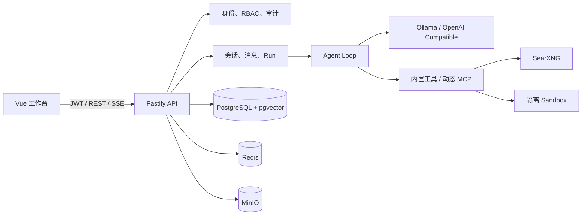
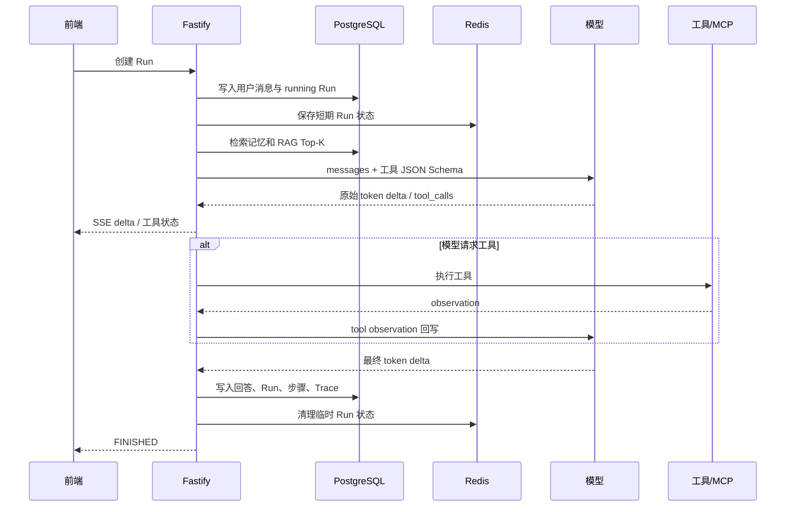

# 项目总说明

`Agent Workbench Platform` 是一个可自托管的个人 Agent 后端。它为已有 Vue 聊天工作台提供本地登录、会话、模型流式输出、模型自主工具调用、文件检索、动态 MCP、执行记录和评测能力。

项目的目标不是做一个把 Prompt 拼好后请求模型的接口，而是把模型的不确定性限制在一个可观察、可停止、可恢复的运行时内。前端负责展示对话、工具状态和历史记录；后端负责身份、状态、执行、存储和外部能力边界。

## 1. 运行边界

| 已实现 | 说明 |
| --- | --- |
| 本地身份与权限 | 注册、登录、Demo 登录、JWT access/refresh token、RBAC 与审计日志。 |
| Agent 对话 | Agent 配置、会话、消息、SSE、收藏、反馈、历史检索、取消 Run。 |
| Agent Runtime | Ollama / OpenAI-compatible 流式调用、Tool Calling Loop、重试、超时、Trace。 |
| 文件 RAG | TXT、MD、CSV、PDF、DOCX 解析，MinIO 原文件、embedding、pgvector 检索。 |
| 动态 MCP | 数据库保存 Server 配置，按 stdio、SSE、Streamable HTTP 动态发现和调用工具。 |
| 可控外部能力 | SearXNG 联网/图片搜索、隔离 JavaScript 沙盒、PPT 文件生成。 |

SSO、企业 OA、云盘、工单、企业组织等外部业务系统不在本项目范围。旧 Vue 前端的非 Agent 页面和接口不会被后端伪造；兼容层只处理机器人相关调用。

## 2. 总体架构



| 层 | 目录 | 职责 | 为什么这样拆分 |
| --- | --- | --- | --- |
| HTTP 入口 | `src/index.js`、`src/platform/*Routes.js` | Fastify 初始化、鉴权、REST、SSE、旧前端兼容接口。 | 把协议、参数校验、数据库事务留在平台层，业务执行不依赖 HTTP。 |
| 运行时 | `src/services/agentService.js`、`modelClient.js` | 模型流、Tool Calling Loop、observation 回写、最大步骤限制。 | 方便对 Ollama 与 OpenAI-compatible 统一处理，也便于独立测试 Agent 行为。 |
| 工具 | `src/services/toolService.js`、`mcp*.js` | 内置工具定义、超时、重试、动态 MCP 映射。 | 工具是 Agent 的能力边界，不能散落在 Prompt 或路由中。 |
| 上下文 | `src/platform/contextService.js`、`documentParser.js` | 记忆、知识检索、文件解析、向量写入。 | 区分短期对话、长期记忆与知识库，避免把所有历史直接塞进 Prompt。 |
| 基础设施 | `docker-compose.yml`、`runStore.js`、`objectStorage.js` | PostgreSQL、Redis、MinIO、SearXNG、沙盒。 | 关系数据、临时状态、原始文件各用合适的存储，避免本地 JSON 成为状态中心。 |

## 3. 一次聊天请求如何执行

客户端调用 `POST /api/v1/chat/runs`，响应为 `text/event-stream`。旧 Vue 页面可以继续调用 `/api/v3/robot/run`，该兼容层会映射到同一套 Run、会话和消息表。



### 为什么使用模型原生 Tool Calling

运行时给模型传入 JSON Schema，而不是用正则从用户问题中猜测工具。模型返回 `tool_calls` 后，后端才执行对应能力，并将结果以 `tool` 消息回写模型。这让“选择工具 → 获取 observation → 生成结论”成为一条明确的链路：Trace 能看到谁选择了什么、工具得到什么、模型最后依据什么回答。

`agents.max_steps` 是循环的硬停止条件。模型连续调用工具超过该限制会报错，而不会无限请求外部服务。每个工具还有独立 timeout 和 retry；重试仅用于临时失败，不能把参数错误掩盖成成功。

### 为什么真流式不做二次切片

`modelClient.js` 直接读取 Ollama NDJSON 或 OpenAI-compatible SSE。每一个 `delta` 原样转给前端，不能先收全模型回答再按字符切开。前者能让前端在模型计算时开始渲染，且前端看到的节奏与模型实际输出一致；后者只会制造“看起来流式”的假象，无法处理取消和中途失败。

## 4. 状态、取消与恢复

| 数据 | 存储 | 用法 | 原因 |
| --- | --- | --- | --- |
| 用户、Agent、会话、消息、Run、步骤 | PostgreSQL | 唯一事实来源，可审计、可查询。 | 这些数据需要长期保存并支持关联查询。 |
| 向量 | pgvector | 用户记忆与知识分块的相似度检索。 | 向量与权限、文件、会话数据在同一事务边界内管理。 |
| 取消标记、最近事件、MCP 工具缓存 | Redis | Run 的短期控制状态。 | 高频、可过期的状态不应频繁更新关系数据库。 |
| 原始上传文件 | MinIO | RAG 文件原件。 | 数据库只存文本、元数据和对象键，避免大对象膨胀。 |

取消接口会同时中止本进程的 `AbortController`，并在 Redis 写入取消标记。每次模型和工具执行前都会检查取消状态。若服务重启，内存中的 Controller 不存在，但 PostgreSQL 里的 `running` Run 会在启动时变为 `interrupted`，保留已有步骤和错误码 `SERVER_RESTART`，前端可以展示原因并让用户重新发起。

## 5. 工具与安全边界

| 工具 | 实现 | 处理方式与原因 |
| --- | --- | --- |
| `calculate` | 递归下降表达式解析器 | 只允许数字、括号和四则运算，避免 `eval`。 |
| `web_search` / `image_search` | 本地 SearXNG | 结果 URL 只接受 HTTP/HTTPS，避免把危险协议交给前端渲染。 |
| `sandbox_javascript` | 独立 Docker 容器 + 网关 | 非 root、只读文件系统、无外网、资源限制；Node `vm` 只做二次限制。 |
| `generate_presentation` | `pptxgenjs` | 生成 `.pptx` 后用有时效的 HMAC 下载链接，避免公开目录暴露所有文件。 |
| MCP 工具 | MCP SDK | 一次调用一次建连、调用后关闭；配置加密保存，工具清单缓存到 Redis。 |

所有工具执行都生成 `type: 12` 的 SSE 工具事件。这一点很重要：聊天前端与企业微信等渠道适配层应把该类型当作“运行状态”，不能降级为文本，否则会把 `[write_file]` 一类内部工具名直接展示给用户。

## 6. RAG 设计

```text
上传文件
  → MinIO 保存原件并返回 storage_key
  → 按文件类型解析文本
  → 800 字符 chunk，100 字符 overlap
  → Ollama embedding
  → knowledge_chunks.embedding 写入 pgvector
  → 查询 embedding 与 chunk 做余弦相似度排序
  → Top-K 片段作为上下文交给 Agent
```

分块带 overlap 是为了避免句子或章节边界被截断，检索到半段内容导致模型失去上下文。原文件和解析文本分开保存：原文件用于追溯和重新解析，解析文本与向量用于低延迟检索。embedding 服务失败时文件状态会变为 `failed`，而不是回退成“看似可检索”的空文档。

## 7. 动态 MCP 设计

1. 管理员通过 `POST /api/v1/mcp/servers` 保存 transport 和配置；配置以 AES-256-GCM 形式写入数据库。
2. `POST /api/v1/mcp/servers/:id/refresh` 使用实际连接调用 `listTools`，并同步工具元数据。
3. Agent Run 开始时读取当前用户可见、已启用的 MCP Server，从 Redis 读取或刷新工具清单。
4. 每个 MCP 工具生成唯一的 Agent 工具名，随其他工具的 JSON Schema 一同发送给模型。
5. 模型选择该工具时，平台映射回真实 `server + toolName`，执行 `callTool` 并把 observation 回写模型。

采用数据库配置而不是固定 demo server，是为了让项目能连接真实的文件、数据库、内部 API 或开发工具 MCP；采用请求作用域建连，是为了避免凭据和连接跨用户长期留在内存。

## 8. 模型与配置

默认本机链路：

```dotenv
LLM_PROVIDER=ollama
OLLAMA_MODEL=qwen3.5:0.8b
OLLAMA_TOOL_MODEL=local-qwen35b-tools:latest
EMBEDDING_MODEL=nomic-embed-text:latest
MODEL_TIMEOUT_MS=60000
```

普通聊天可用轻量模型；默认 Agent 的数据库配置使用 `local-qwen35b-tools:latest`，因为 Tool Calling 对结构化输出稳定性要求更高。`nomic-embed-text` 专门用于向量，不用聊天模型兼做 embedding，目的是让检索维度稳定且成本更可控。

切换到 OpenAI 或任意兼容网关时，设置 `LLM_PROVIDER=openai-compatible`、`OPENAI_BASE_URL`、`OPENAI_API_KEY`、`OPENAI_MODEL` 后重启即可。密钥只通过环境变量注入，不能写进 Agent、MCP 或前端配置。

## 9. 目录与数据模型

| 目录 / 文件 | 阅读重点 |
| --- | --- |
| `src/index.js` | 应用装配、依赖注册、健康检查与旧接口兼容层。 |
| `src/platform/identity.js` | JWT、refresh token、角色和权限。 |
| `src/platform/chatRoutes.js` | Agent、Session、Run 的原生 API 和 SSE 持久化。 |
| `src/platform/runtimeRoutes.js` | 知识库、文件上传、MCP、Trace、评测、指标。 |
| `src/services/modelClient.js` | Ollama / OpenAI 流协议适配。 |
| `src/services/agentService.js` | 模型原生 Tool Calling Agent Loop。 |
| `src/services/toolService.js` | 内置工具、动态 MCP 映射、超时与重试。 |
| `src/platform/contextService.js` | 记忆与 RAG 向量检索。 |
| `migrations/` | 从身份模型到运行时、兼容层、恢复状态、工具模型的演进。 |
| `test/` | 单元、协议和真实基础设施集成测试。 |

核心关系是：`users → agent_sessions → messages / agent_runs → agent_run_steps`。知识库走 `knowledge_bases → knowledge_documents → knowledge_chunks`；MCP 走 `mcp_servers → mcp_tools`。所有查询都带 user/owner 条件，避免不同用户读取彼此的会话、记忆和知识片段。

## 10. 启动、排障与验收

```bash
cp .env.example .env
npm install
ollama serve
npm run db:up
npm run db:migrate
npm start
```

启动后依次检查：

```bash
curl http://127.0.0.1:8788/health
curl http://127.0.0.1:8788/api/v1/platform/health
npm run check
npm test
npm run test:integration
```

| 现象 | 首先检查 |
| --- | --- |
| 模型超时 | `ollama serve`、`ollama list`、`MODEL_TIMEOUT_MS`、本机内存。 |
| 上传后无法检索 | MinIO `9000`、embedding 模型、文档状态是否为 `ready`。 |
| MCP 工具列表为空 | Server 是否 enabled、`refresh` 是否成功、transport 地址和凭据。 |
| 前端显示工具名 | SSE 消费端是否把 `type: 12` 误渲染为文本。 |
| Run 长期显示运行中 | 查 `agent_runs`；重启后应为 `interrupted`，而不是继续伪装运行。 |

验收用例、接口示例和测试命令见 [API 文档](api-v1.md)、[运行时验收](runtime-completion.md) 与 [集成测试](../test/platformIntegration.test.js)。
